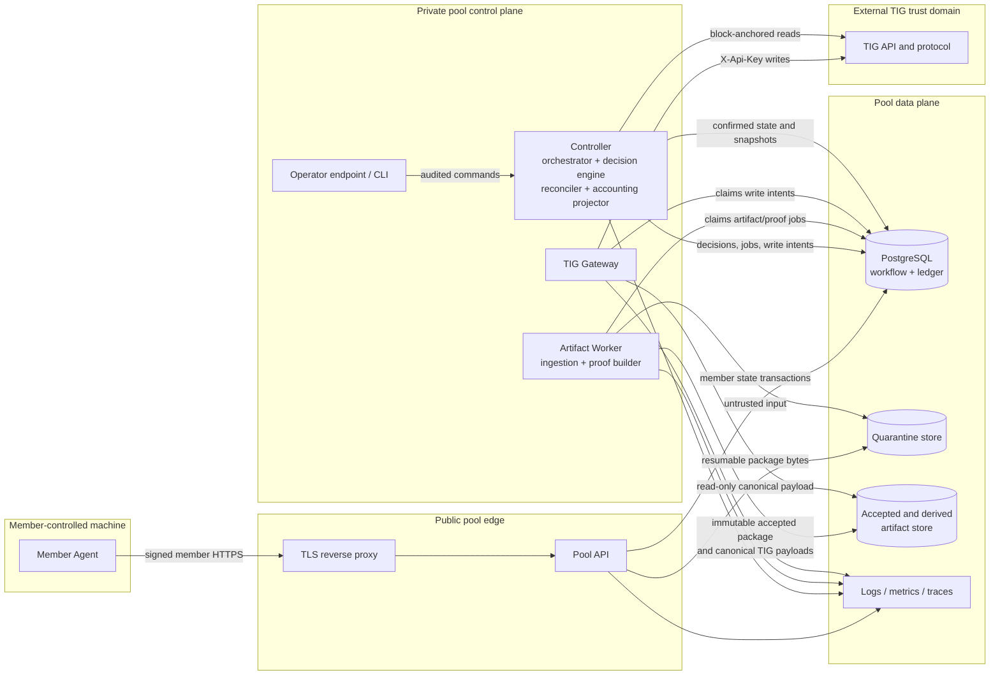

# TIG mining pool: minimal system architecture

Status: accepted architecture for the protocol spike and v0  
Last updated: 2026-09-04

This document defines how the settled mining rules in
[mining_system.md](mining_system.md), the TIG integration in
[tig_integration.md](tig_integration.md), and the member wire contract in
[member_protocol.md](member_protocol.md) are implemented. Those documents own
protocol meaning. This document owns component, process, storage, transaction,
and deployment boundaries.

The architecture is deliberately a small number of restart-safe processes, not
a microservice for every module. PostgreSQL is the durable workflow bus. Large
member outputs stay in an artifact store and never become ordinary database
values.

## 1. Architectural decisions

The initial implementation uses:

- one Cargo workspace, stable Rust, and the Rust 2024 edition for both the
  backend and member agent;
- Tokio for asynchronous execution and Axum `0.8` for HTTP services;
- PostgreSQL 18, kept on its current supported minor release, as the workflow
  database and accounting-ledger store;
- SQLx `0.9` with reviewed, forward-only SQL migrations run by a dedicated
  migration command;
- a filesystem artifact-store adapter for local development and AWS S3
  Standard in separate testnet and production buckets;
- PostgreSQL work queues, transactional outboxes, unique constraints, row
  locks, and fenced leases instead of Redis, Kafka, or a separate workflow
  engine in v0; and
- structured `tracing` events, Prometheus-format metrics, and OpenTelemetry
  traces exported over OTLP.

Exact Rust, crate, container, and database image versions and digests are
pinned when the repository skeleton is created. A committed `Cargo.lock` and
`rust-toolchain.toml` make a build reproducible. The choices and their revisit
conditions are recorded in [the architecture decision records](adr/README.md).

These choices follow the currently supported upstream lines: Axum 0.8 is a
Tokio/Hyper HTTP framework, SQLx 0.9 supports Tokio, and PostgreSQL 18 remains
supported until 2030. See the
[Axum documentation](https://docs.rs/axum/0.8/axum/),
[SQLx documentation](https://docs.rs/sqlx/0.9/sqlx/), and
[PostgreSQL version policy](https://www.postgresql.org/support/versioning/).

## 2. System and trust boundaries



The arrows distinguish three kinds of flow:

- member data flows from the member agent through the Pool API into quarantine,
  then through the isolated Artifact Worker into the accepted store;
- control state flows through PostgreSQL jobs, intents, events, and immutable
  receipts; and
- TIG writes flow only from the TIG Gateway. Confirmed TIG reads flow back
  through the controller and are the authority for protocol state.

### 2.1 Trust boundaries

1. The member machine is untrusted. Its signature establishes the worker
   identity, not the correctness or safety of its package.
2. The Pool API is internet-facing. Compromise of it must not expose a TIG
   credential or grant permission to create a TIG write intent.
3. The Artifact Worker parses attacker-controlled archives and solution data.
   It runs separately with bounded CPU, memory, temporary disk, and object-store
   permissions, and it has no TIG credential.
4. The TIG Gateway is the credential boundary. It has no public listener, no
   member-authentication responsibility, and no permission to alter decisions,
   accepted packages, or accounting entries.
5. TIG is an external source of confirmed protocol truth. A successful HTTP
   write is recorded as an attempt, never treated as confirmation.
6. Operator access is a separate administrative boundary. Operators issue
   reasoned, idempotent commands; they do not edit workflow or ledger rows by
   hand.

### 2.2 TIG credential and signing boundary

The TIG account signing key is used only for manual operations — API-key
provisioning or rotation, and `accounting.md` §8.3a's per-round sweep of a
settled round out of the reward wallet — and is not present in any v0 runtime
process. The sweeps are infrequent by construction: TIG's payment delay is
weeks, so they are two operator-signed transfers per paid round — one to
member custody, one to operating custody — never a hot path.

On testnet, the dedicated operator-controlled browser wallet may sign TIG's
ownership proof through the official operator UI, following
`tig_integration.md` section 4. The browser and
wallet extension remain part of the operator workstation, not the pool runtime.
This testnet-only exception carries no production authority. A production or
mainnet signing key remains offline or hardware-/managed-key protected and
requires the separate custody decision described in `security.md` section 3.3.
The bounds and rationale are recorded in
[ADR 0007](adr/0007-testnet-browser-wallet.md).

The TIG API key is loaded only by `tig-gateway`. It never enters the Pool API,
controller, Artifact Worker, member agent, database, artifact objects, logs,
traces, or assignment messages.

In production the gateway receives the API key through a secret-manager-backed
file or equivalent workload secret mount. The file is readable only by the
gateway identity. Local and testnet credentials use a separate testnet key and
an untracked secret file. Database roles and network policy reinforce the
process boundary; sharing a repository or Rust library does not grant access to
the secret.

## 3. Component responsibilities

| Component | Owns | Explicitly does not own |
|---|---|---|
| **Member Agent** | Worker keys; slot discovery; qualification; capacity offers; confirmed assignment execution; every nonce output; quality vector and Merkle material; resumable upload until receipt | TIG credentials or writes; orchestration; sampled proof serving after durable receipt; payout calculation |
| **Pool API** | Member protocol termination; request authentication and authorization; replay checks; enrollment/rotation; slot registration and qualification; durable member command/event inbox; assignment/status reads; upload sessions and acknowledged quarantine chunks; returning immutable receipts | Mining decisions; operational slot reservation/release; TIG reads or writes; semantic validation; archive extraction; accepted-artifact deletion; ledger posting |
| **Controller** | Block-consistent TIG snapshots; active metadata cache; member admission; offer disposition and operational slot state; decisions; assignment and protocol workflow state machine; deadline monitoring; reconciliation; durable acceptance transaction; proof-completion orchestration; qualifier attribution; accounting projection; audited operator-command application | Public member traffic; bulk archive processing; proof construction bytes; possession or use of the TIG API key; physical artifact deletion |
| **Decision Engine** | A pure, deterministic implementation of `decide(...)` using one persisted complete snapshot, persisted in-flight facts, and member status | Network I/O; database writes; random values not supplied explicitly; protocol submissions |
| **TIG Gateway** | The TIG API key; serialized and rate-limited protocol writes; canonical transport encoding; write-attempt ledger; reconciliation before retry; returning transport results | Choosing work; changing workflow state from HTTP success; member traffic; constructing commitments or proofs; accounting |
| **Artifact Worker / Proof Builder** | Bounded package parsing; structural checks; accepted-object publication; canonical commitment payload construction; sampled proof construction; artifact checksum checks before use; derived payload publication; physical deletion and deletion result | Semantic solution correctness; TIG submissions; orchestration policy; member trust decisions; releasing work before durable publication |
| **Artifact Store** | Quarantine bytes and one immutable authoritative accepted package per benchmark; derived commitment/proof payloads; provider integrity metadata | Workflow authority; member ownership; lifecycle decisions; accounting facts |
| **Workflow Database** | Compact authoritative workflow, idempotency, snapshot, ownership, artifact-reference, job, intent, attempt, lease, audit, and ledger facts | Large packages, raw per-nonce solution bodies, or an unbounded copy of TIG responses |
| **Accounting Ledger** | Append-only per-block attribution; balanced credit, round-settlement, deposit, slash, withdrawal, and custody-sweep batches under `accounting.md`; immutable corrections; reconciliation status | TIG reward calculation; orchestration; possession of custody or payout signing keys |
| **Funds Gateway** | Separate member-custody and operating signer identities; allow-listed Base/TIG transfer simulation, signing, broadcast attempts, and ambiguous-result reconciliation for immutable approved intents | Mining decisions; withdrawal calculation; deposit/slash policy; creating or editing intents; ledger posting; the reward wallet's protocol identity key |
| **Monitoring / Operator Tools** | Health visibility, alerts, read-only inspection, and audited commands with actor, reason, and idempotency key | Direct table edits; secret display; unrecorded retries or payout changes |

The controller remains logically accountable for completing proofs: it observes
the confirmed sample, creates and monitors the proof job, owns the deadline and
failure state, and creates a proof-submission intent only after the result is
ready. The Artifact Worker performs the large, hostile-data work so a slow or
malformed package cannot block the controller event loop.

## 4. Initial process layout and split interfaces

The first deployed build has these binaries:

```text
member-agent       member machine
pool-api           public member HTTPS service behind the TLS proxy
pool-controller    private snapshot, orchestration, reconciliation and accounting process
artifact-worker    private ingestion, proof and deletion worker
tig-gateway        private, credential-bearing TIG writer
pool-admin         operator CLI; normal commands call the private controller endpoint;
                   the migrate subcommand is a one-shot database operation
```

Inside `pool-controller`, the snapshot ingestor, active-benchmark cache,
orchestrator, decision engine, reconciler, qualifier attributor, accounting
projector, and operator-command applier initially share one process. Accounting
uses separate modules and append-only tables but is not a separate service.

Inside `artifact-worker`, structural ingestion, accepted-object publication,
commitment-payload construction, proof construction, and deletion initially
share one process with separate bounded worker pools. The public API, artifact
worker, controller, and TIG gateway never share a process in a deployed
environment because their trust and resource boundaries differ.

Modules communicate through typed Rust ports. Durable cross-process handoffs
use versioned PostgreSQL job, outbox, and result rows, not in-memory channels.
This allows a module to become a separate process later without changing mining
rules:

```text
SnapshotSource        BlockSnapshotStore
DecisionPolicy        WorkflowRepository
ArtifactStore         ArtifactJobRepository
TigReadClient         TigWriteIntentRepository
AttributionPolicy     LedgerRepository
TelemetrySink         OperatorCommandRepository
```

No network RPC is introduced merely to separate code. A broker is added only
if measured PostgreSQL queue contention or fan-out requires it.

`funds-gateway` is not part of the no-public-funds protocol spike. It is added
as a private, separately deployed process before accepting member deposits or
making mainnet withdrawals. Its member-custody and operating instances use
different keys, policies, and custody addresses even if they share code.

## 5. Benchmark and payout flows

### 5.1 Offer through confirmed assignment

1. Pool API authenticates a capacity offer and records its idempotent command.
   It does not decide whether the member may receive work.
2. Controller claims the command, locks the offered slot, applies qualification,
   tier, collateral, and open-work rules. An ineligible offer becomes
   `NO_ACTION` / `REJECTED`. If the member is eligible but
   `internal_pool_unverified_limit` is full or an older live FIFO entry exists,
   the Controller records `QUEUED` with a renewable lease and no TIG or
   collateral reservation. Otherwise it reserves the slot as `PENDING`.
3. When global capacity opens, Controller selects the live queued offer with
   the smallest `(queue_accepted_at, offer_id)`, rechecks every admission gate,
   and requests a short availability confirmation. Expired, cancelled, or
   ineligible entries are skipped without creating a TIG write.
4. For a newly admitted or reconfirmed queued offer, Controller atomically
   rechecks member and global unverified counts, reserves collateral and the
   capacity position, loads one complete persisted TIG snapshot,
   derives and persists any block-specific tie input required by the mining
   rules, calls the pure Decision Engine, and records the decision and one
   `PRECOMMIT` write intent in one transaction. The assignment does not yet
   exist.
5. TIG Gateway claims that intent, reconciles it, submits at most one unresolved
   precommit in the serialized lane, and records the attempt and response.
6. Controller observes the confirmed precommit through TIG reads, records its
   authoritative settings, creates the assignment, and makes it visible to the
   member. HTTP write success alone cannot do this.

### 5.2 Package acceptance and benchmark commitment

1. Pool API durably acknowledges each upload chunk into quarantine and records
   its committed range. An uncommitted partial chunk is never reported as
   committed.
2. Finalization verifies that the durable chunk ledger covers the declaration
   exactly and creates one structural-ingestion job keyed by `package_id`. It
   does not synchronously read or unpack the whole package in the public API.
3. Artifact Worker streams the package under resource limits, verifies its
   complete compressed size and SHA-256 before reporting `RECEIVED`, verifies
   all structural rules in the member protocol, and publishes one immutable
   accepted object plus a canonical benchmark-commitment payload.
4. Artifact Worker commits a fenced publication result containing the exact
   accepted-object metadata. Controller consumes that result and, in one
   database transaction, records the accepted artifact reference, transitions the assignment to
   `PACKAGE_DURABLY_ACCEPTED`, releases the slot, creates the immutable receipt,
   and creates the controller event. A lost HTTP response returns that same
   receipt on status or retry.
5. Controller creates one `BENCHMARK` write intent referencing the canonical
   payload. TIG Gateway reconciles, submits it, and records its attempt.
6. Controller advances only after a TIG read confirms the benchmark.

### 5.3 Sampled proof

1. Controller observes confirmed sampled nonces and atomically creates one
   fenced proof job for the benchmark.
2. Artifact Worker reads the accepted package, recomputes its whole-object
   SHA-256 before trusting it, builds exactly the requested branches, checks
   them against the committed root, and publishes a canonical proof payload.
3. Controller verifies the compact job result and creates one `PROOF` write
   intent that names the payload and its checksum.
4. TIG Gateway checks that exact payload, reconciles confirmed TIG state, and
   submits only if still required.
5. Controller advances through proof confirmation, verification, and active or
   terminal state using confirmed reads.

### 5.4 Per-block attribution and ledger projection

1. Controller persists one complete, block-anchored snapshot before using it.
2. The attribution module deterministically calculates and stores member bundle
   attribution, including the persisted random seed and boundary selection.
3. The accounting projector creates at most one ordinary journal batch for
   `(network, block_id)` and records the policy version selected for that block.
4. The batch transaction stores the pool proceeds input, member weights,
   allocations, balanced journal entries, and an outbox event together. It
   commits only if attribution totals reconcile with TIG facts.
5. A later correction is a new reversing or adjusting batch; historical entries
   are never updated in place.

### 5.5 Round settlement and member withdrawal

Settlement and withdrawal are separate flows under ADR 0008: a round settles
into balances automatically, and a transfer happens only when a member asks.

1. Controller reconciles every block allocation to TIG's closed round, waits
   for the exact delayed TIG payment to be finalized in the reward wallet, and
   creates that round's two `(network, round, leg)` sweep intents
   (`accounting.md` §8.3a — one per destination address, since an ERC-20
   transfer has one recipient). It signs neither: the reward-wallet key is the
   protocol identity of §2.2, an operator signs each transfer manually, and
   the controller posts each completion from its own finalized event. An
   ambiguous broadcast is reconciled by signer nonce, transaction, receipt and
   exact token event before any re-signing, exactly as for a Funds Gateway
   transfer — the intent key bounds the ledger, not the chain.
2. The accounting projector posts the settlement, crediting each eligible
   member's single balance. No transfer intent is created.
3. On a member withdrawal request, the projector checks the amount against the
   member's unencumbered balance and creates one immutable withdrawal intent
   atomically with the liability move.
4. Funds Gateway claims an approved intent, checks chain/token/destination/
   amount and signer limits, and records the signed transaction hash and nonce
   before broadcast.
5. Ambiguous sends are reconciled by signer nonce, transaction, receipt, and
   exact token event; a retry cannot create another transfer.
6. Controller posts completion only from the finalized exact event. A held
   member does not block other members and keeps their balance.

§8.6's sweep of pool value out of member custody follows the same intent,
signing and confirmation path, with its destination allow-listed to operating
custody.

The exact token unit, fee, rounding, finality, suspense, corrections, balance,
and withdrawal rules are defined in [accounting.md](accounting.md). This
architecture fixes their append-only and idempotent posting boundary.

## 6. State-change ownership

Every state-changing operation has one component authorized to perform it.
Other components request work or report facts; they do not perform the owner's
transition.

| Operation | Sole owner | Durable idempotency / guard |
|---|---|---|
| Enroll or rotate worker credential | Pool API | Enrollment or rotation ID plus request hash |
| Recover/revoke worker credential | Pool API | Recovery/command ID, worker binding, and current credential state |
| Register/reconfigure/qualify slot | Pool API | Registration or qualification-result ID and current generation |
| Record a member offer, event, or heartbeat command | Pool API | Offer/event/heartbeat ID and canonical request hash |
| Admit/reject/queue an offer and reserve its slot | Controller | Slot row lock, tier/qualification checks, per-member queue allowance, and one-open-work-per-slot constraint |
| Promote a queued offer | Controller | FIFO key, live lease and availability acknowledgement, tier row lock, and serialized global-capacity gate |
| Join or rejoin a tier | Controller accounting projector | Member/tier/policy version plus a finalized non-refundable fee batch; existing exposure is unchanged |
| Accumulate and close round tier metrics | Controller reconciler | Network/round/member/tier-membership key and accepted-block cursor |
| Apply member-reported assignment progress | Controller | Event ID, assignment revision, and valid state transition |
| Create a confirmed assignment | Controller | Confirmed TIG benchmark ID and permanent ownership constraint |
| Choose work and record a decision | Controller | One decision per claimed offer and snapshot; decision input digest |
| Create or cancel a TIG write intent | Controller | Unique workflow, write kind, generation, and payload hash |
| Transmit a TIG write and record attempt | TIG Gateway | Intent ID; serialized precommit lane; benchmark write uniqueness |
| Advance confirmed TIG lifecycle | Controller reconciler | Confirmed TIG evidence and monotonic workflow revision |
| Record a block data gap | Controller reconciler | Network and height, one row per missing height |
| Commit upload bytes/ranges to quarantine | Pool API | Upload ID, offset, length, and chunk checksum |
| Create/resume/finalize upload session | Pool API | Package ID, upload ID, declaration hash, and committed size |
| Create structural-ingestion job | Pool API | One job generation per finalized package ID |
| Verify complete package bytes and report `RECEIVED` | Artifact Worker | Fenced job, declared size, and whole compressed SHA-256 |
| Validate and report structural package result | Artifact Worker | Fenced ingestion job and package generation |
| Publish accepted artifact and derived payload | Artifact Worker | Deterministic immutable key and content hash |
| Apply `RECEIVED` and structural results to workflow | Controller | Fenced result, assignment revision, and package generation |
| Record durable acceptance, receipt, and slot release | Controller | One accepted package per assignment; one transaction |
| Request and monitor proof construction | Controller | One proof job generation per confirmed sample digest |
| Build proof or commitment bytes | Artifact Worker | Job fence, source artifact hash, and requested-input digest |
| Attribute qualifiers | Controller attribution module | Network/block/policy version and stored random seed |
| Record member/pool/TIG failure attribution | Controller reconciler | Terminal evidence, workflow revision, and reason code |
| Append an accounting batch/correction | Controller accounting projector | Network/block/policy version or correction ID |
| Recognize a custody deposit or TIG round settlement | Controller accounting projector | Chain ID, transaction hash, log index, exact token/address, and finalized block |
| Freeze/finalize a security-deposit charge | Controller accounting projector | Policy version, the benchmark outcome the charge rests on, and approved command ID. Not fault evidence and not an appeal state: `accounting.md` §11.6 charges independently of cause and has no in-system appeal |
| Record a member withdrawal request | Pool API account system | Member ID, request ID, canonical request hash, and reauthentication evidence |
| Advance, reduce, or cancel a recorded withdrawal request | Controller accounting projector | Request ID plus request revision; the same transaction that posts `accounting.md` §8.5's batch or §10's correction |
| Create a member withdrawal or custody-sweep intent | Controller accounting projector | Network/member/withdrawal generation for a withdrawal; network/round/leg for a reward-wallet sweep; and for an operating sweep, `accounting.md` §8.6's cause identifier — tier activation, `X` charge decision, finalized slash, suspense resolution, or correction ID — plus an immutable amount/destination in every case |
| Sign/broadcast a funds transfer from member or operating custody | Funds Gateway | Approved intent ID, allow-listed call, signer nonce, and signed transaction hash |
| Sign/broadcast a reward-wallet sweep leg | Operator, manually, with the offline reward-wallet key | Approved `(network, round, leg)` intent ID and the signed transaction hash |
| Confirm a funds transfer and post completion | Controller accounting projector | Finalized receipt plus exact token Transfer event |
| Decide artifact retention eligibility | Controller reconciler | Confirmed active/terminal evidence and no pending dependency |
| Physically delete an artifact | Artifact Worker | Deletion job ID, artifact version, and recorded result |
| Request an administrative override | Operator tool | Operator-command ID, actor, reason, and authentication |
| Apply an administrative override | Controller | Pending command row, policy authorization, and workflow revision |
| Apply a schema migration | `pool-admin migrate` | SQLx migration version/checksum under migration lock |

Database grants enforce the important portions of this table. In particular,
the Pool API role cannot insert TIG write intents or ledger batches, and the
gateway role cannot change workflows or create intents.

## 7. Database, transactions, and concurrency

### 7.1 Database and migration policy

One PostgreSQL 18 cluster and logical database initially holds workflow and
ledger schemas. Separate least-privilege login roles exist for API, controller,
artifact worker, gateway, read-only monitoring, and migrations.

Migrations are forward-only SQL files in one ordered directory and are applied
by `pool-admin migrate` before incompatible application code starts. Normal
services do not own DDL privileges or auto-migrate at startup. Each migration
is tested against an empty database and a copy of the preceding schema. A
rolling change first adds backward-compatible fields and constraints, deploys
code, then removes obsolete shapes in a later reviewed migration.

The schema remains incremental: a table or field is added only with the first
implemented query, invariant, recovery action, or audit requirement that needs
it. Raw TIG responses and per-nonce outputs are not retained in PostgreSQL by
default.

### 7.2 Transaction boundaries

Transactions are short and never remain open across TIG, member, or
object-store network I/O. The important boundaries are:

- member request idempotency record plus its state mutation and response;
- decision plus the new TIG write intent;
- confirmed lifecycle transition plus any resulting job or event;
- durable artifact pointer plus receipt, assignment transition, slot release,
  and controller event;
- proof-job creation plus workflow revision;
- attribution facts plus their reconciliation result; and
- one balanced accounting journal batch plus its outbox event.

Object storage and PostgreSQL cannot share a transaction. Section 8 defines the
ordered publication protocol that makes the cross-store operation retryable.

### 7.3 TIG write idempotency

Each write intent has an immutable `intent_id`, `network`, `write_kind`,
`workflow_id`, `generation`, canonical payload SHA-256, optional payload
artifact ID, and state. A unique constraint covers:

```text
(network, workflow_id, write_kind, generation)
```

Slice 1 defines the intent states `PREPARED`, `OUTCOME_UNKNOWN`, `CONFIRMED`
and `REJECTED`. `CONFIRMED` and `REJECTED` are set only from confirmed TIG
reads, never from a transport status (`tig_integration.md` §7). Identity, key,
payload digest, payload artifact pointer, benchmark binding and creation
timestamp are immutable once written; only state changes, and only forwards —
`CONFIRMED` and `REJECTED` are terminal and nothing returns to `PREPARED`, which is why the intent table grants `UPDATE` but enforces the rest
with a trigger rather than by convention.

Changing a canonical payload requires an explicit new generation and is
forbidden once an earlier attempt may have reached TIG unless reconciliation
proves it safe. Benchmark and proof generations are also bound to the TIG
`benchmark_id`. The gateway records every attempt before sending, then records
the response separately. On an ambiguous outcome it leaves the intent
`OUTCOME_UNKNOWN`, reconciles against confirmed TIG state, and never blindly
duplicates the write. Precommits additionally use the single unresolved lane
defined in the TIG integration contract.

### 7.4 Accounting idempotency

The initial ledger boundary reserves these uniqueness rules even before the
numeric policy is implemented:

```text
ordinary block batch: (network, block_id)
correction batch:     correction_id
journal entry:        (batch_id, line_number)
member attribution:   (network, block_id, benchmark_id, bundle_index)
```

A journal batch is visible only when every line and its reconciliation facts
commit. Retrying produces the same batch. Corrections append; they do not
change the idempotency key or values of an earlier batch.

### 7.5 Controller and worker concurrency

Short transitions lock the workflow row with `SELECT ... FOR UPDATE` and use a
monotonic `revision`. Long work uses a claim row containing `lease_owner`,
`lease_until`, and an incrementing `fence_token`:

1. a process claims eligible work in a short transaction, commonly with
   `FOR UPDATE SKIP LOCKED`, increments the fence, and commits;
2. it performs network or bulk work without a database transaction;
3. it commits the result only with a compare-and-set on the workflow revision
   and exact fence token; and
4. after lease expiry another process may reclaim the work with a higher fence,
   making a late result from the old owner unable to commit.

Unique constraints remain the final duplicate defense. Singleton activities
such as accepting the next TIG block or using the precommit submission lane
also use a named database lease with the same fencing rule. This permits
multiple standby controllers and workers without allowing two of them to
advance one benchmark.

### 7.6 Minimal tier and availability-queue state

The tier implementation adds only the state required by its first queries and
audits:

- the current tier membership plus append-only join/removal history, joining
  fee batch, and policy version;
- each capacity offer's status, FIFO key, lease, ready-check state, slot, and
  terminal reason;
- the permanent member owner and unverified interval of each benchmark;
- one aggregate row per member/tier membership/round containing accepted-block
  sample count, unverified benchmark-blocks, verified benchmark-blocks,
  chargeable failure count, and the resulting tier decision; and
- versioned `J[k]` and `internal_pool_unverified_limit` policy values. No
  failure-charge policy value is stored: ADR 0013 derives the charge from the
  benchmark's own precommit fee and penalty, so there is nothing to version.

Closing a tier membership and cancelling its still-queued/ready-check offers is
one transaction. Offers that already own a precommit intent are not cancelled;
their benchmarks and financial exposure remain attached to the member.

The controller does not store one tier-sampling row per member per block. Once
per accepted block, the reconciler advances each affected aggregate exactly
once using the accepted-block cursor. Lifecycle events remain the audit source
from which an aggregate can be independently rebuilt.

Global admission and queue promotion use the serialized precommit-admission
lease. In the same transaction the Controller recounts authoritative
unverified workflows, checks `pool_unverified < internal_pool_unverified_limit`,
checks `member_unverified < tier_number`, reserves the financial exposure, and
creates the precommit intent. A cached metric can drive alerts but can never
authorize work.

## 8. Artifact storage and lifecycle

### 8.1 Backends by environment

| Environment | Quarantine | Authoritative accepted and derived artifacts |
|---|---|---|
| Local development and CI | Configured local directory on one filesystem | Separate configured directory on the same durable local volume |
| Deployed TIG testnet | Dedicated AWS S3 Standard quarantine bucket/prefix | Dedicated non-production AWS S3 Standard accepted bucket/prefix |
| Production | Dedicated AWS S3 Standard quarantine bucket/prefix | Dedicated production AWS S3 Standard accepted bucket/prefix |

Testnet uses the production storage API so the protocol spike measures real
multipart, checksum, latency, retry, and lifecycle behavior. It never shares a
bucket, credential, or prefix with production. Local integration tests run the
same `ArtifactStore` contract against the filesystem adapter.

Amazon S3 provides strong read-after-write behavior for object PUT, GET, HEAD,
and DELETE operations. The implementation also supplies provider checksums for
multipart parts and maintains its own protocol SHA-256 because a multipart
ETag is not a whole-object digest. See the
[S3 consistency model](https://docs.aws.amazon.com/AmazonS3/latest/userguide/Welcome.html#ConsistencyModel)
and [S3 object-integrity guidance](https://docs.aws.amazon.com/AmazonS3/latest/userguide/checking-object-integrity-upload.html).

### 8.2 Quarantine and authoritative publication

Member-provided names never become paths or object keys. The service derives
all locations from validated opaque IDs. Conceptual keys are:

```text
quarantine/<network>/<upload_id>/<part_number>
accepted/<network>/<benchmark_id>/<package_id>/<package_sha256>.tar.br
derived/<network>/<benchmark_id>/<kind>/<input_digest>.json.br
```

Quarantine is durable upload progress but is not an accepted artifact. The
Artifact Worker streams it through bounded validation while it writes a new
immutable accepted object. A failed validation aborts publication.

Each quarantine chunk is first written under a deterministic upload ID, offset,
length, and checksum, then verified in the store, and only then added to the
contiguous committed-range ledger in a database transaction. The Pool API
never advances the returned offset before the object is durable. A crash after
the chunk write but before that transaction lets an identical retry verify and
adopt the chunk; a conflicting retry fails, and an unattached chunk becomes an
orphan after the grace period. The filesystem adapter likewise uses immutable
per-chunk files rather than relying on a database transaction to make an append
atomic.

For the filesystem adapter, publication means writing a non-followed temporary
file on the accepted filesystem, verifying size and hash, calling `fsync` on
the file, atomically renaming it to its deterministic final name, and calling
`fsync` on the parent directory. For S3, it means completing the accepted
multipart object with part integrity checks, then issuing a strongly consistent
HEAD and verifying expected key, length, and checksum metadata. The worker's
streaming SHA-256 must equal the package declaration. Proof construction
recomputes that SHA-256 before using the package.

Only after publication verification does the Artifact Worker commit its fenced
job result. The controller then commits the durable-acceptance transaction.
This creates a safe retryable saga:

- crash before accepted publication: retry or abort the incomplete upload;
- crash after publication but before the database commit: discover the
  deterministic object, verify it, and retry the same transaction;
- crash after the database commit but before the member response: return the
  stored immutable receipt; and
- abandoned unreferenced publication: an orphan sweep may delete it only after
  a configured grace period and a database non-reference check.

There is exactly one authoritative full package: the accepted object named by
the current database artifact row. Quarantine parts and derived TIG payloads
are separate artifacts with their own states; none is an alternative source of
truth for the package.

### 8.3 Database artifact reference

The compact artifact row stores only fields required by implemented behavior,
chosen from this contract as each slice is built:

```text
artifact_id                  opaque pool ID
assignment_id / benchmark_id owner and protocol binding
kind                         PACKAGE | COMMITMENT_PAYLOAD | PROOF_PAYLOAD
backend                      FILESYSTEM | S3
container                    volume name or bucket
object_key                   pool-generated relative key
provider_version             version ID when the backend supplies one
format_version / media_type  decoding contract
sha256                       protocol whole-object digest
provider_checksum            transport/storage integrity metadata
compressed_size              stored bytes
uncompressed_size            package only
manifest_sha256              package only
lifecycle_state              QUARANTINE | PUBLISHING | ACCEPTED | DELETABLE | DELETED | DELETE_FAILED
accepted_at / deletable_at / deleted_at
```

An S3 ETag may be stored for diagnostics but is never used as the package
integrity check. Absolute filesystem paths and arbitrary URLs are not accepted
from a member. Access is always resolved through the configured backend and
validated relative key.

### 8.4 Retention and deletion ownership

The controller alone decides that confirmed TIG state and pending work make an
artifact deletable. It creates an idempotent deletion job. The Artifact Worker
alone performs physical deletion and records the provider result. It rechecks
the expected artifact ID, object version, lifecycle state, and absence of a
pending dependency before deletion.

The accepted package is never subject to an automatic time-based bucket rule
that could race the workflow. Provider lifecycle rules may abort abandoned
multipart uploads and remove old quarantine or already-deleted versions after
a safety period. Failure to delete is visible and retried; a missing accepted
object before eligibility is a pool incident, not a member failure.

## 9. Configuration and secrets

Each binary receives one explicit non-secret TOML configuration path. Startup
parses into typed structures, rejects unknown fields, validates cross-field
invariants, and exits before serving or claiming work on error. Network has no
production default. The controller also loads and validates the pinned
[`tig_integration.json`](../config/tig_integration.json). A digest of
decision-affecting configuration is stored with each decision and accounting
batch.

Secrets do not appear in TOML, command-line arguments, database values, crash
reports, or ordinary environment dumps. Production uses workload identity or
secret-manager-backed files:

| Secret/capability | Available to |
|---|---|
| Member Ed25519 private key | Member Agent only |
| TIG account signing key (reward wallet) | Manual operations only — API-key provisioning/rotation and `accounting.md` §8.3a's per-round reward-wallet sweep: dedicated operator browser wallet on testnet; offline or hardware-/managed-key protected in production. Never in a runtime process, including Funds Gateway |
| TIG API key | TIG Gateway only |
| API database credential | Pool API only, API role |
| Controller database credential | Controller only, controller role |
| Artifact store write/delete capability | Artifact Worker, scoped by prefixes/actions |
| Quarantine write capability | Pool API, quarantine only |
| Derived-payload read capability | TIG Gateway, read only |
| TLS private key | Edge proxy only |
| Migration credential | One-shot migration job only |

Development secret files are ignored by version control and contain only
testnet/local credentials. Configuration errors, missing secrets, gateway
authentication failure, and TIG schema incompatibility fail closed for new
writes.

## 10. Observability and operator controls

### 10.1 Logs and traces

Every process emits structured JSON with timestamp, severity, service,
deployment, network, event name, and relevant opaque correlation IDs:
`request_id`, `member_id`, `worker_id`, `offer_id`, `assignment_id`,
`benchmark_id`, `artifact_id`, `job_id`, `intent_id`, `block_id`, and
`trace_id`. Sensitive or bulky fields are allow-listed rather than
deny-listed: secrets, signatures, enrollment tickets, solution bodies, raw
packages, full TIG payloads, and full member aliases are never ordinary log or
trace attributes.

W3C trace context crosses HTTP. Durable jobs and intents store the originating
trace ID so work resumed after a restart remains correlated. Traces cover
member request handling, snapshot assembly, decisions, artifact ingestion,
proof construction, gateway attempts, and accounting batches, but do not
sample payload bodies.

### 10.2 Minimum metrics

The spike exports at least:

- latest observed and latest accepted TIG height, snapshot age, refresh
  duration, refresh failures, and missing-block gaps;
- workflows by state, age, terminal reason, and remaining block reserve;
- offers, assignments, member events, and request replays by result;
- upload bytes, committed offsets, throughput, duration, rejection reason, and
  incomplete upload age;
- quarantine and accepted bytes, object counts, validation duration, proof
  duration, checksum failure, deletion backlog, and deletion failure;
- PostgreSQL pool saturation, query errors, transaction retries, job queue
  depth, oldest job, lease expiry, and stale-fence rejection;
- TIG request latency, status class, throttling, attempt state, confirmation
  latency, unresolved write age, and gateway authentication failures; and
- attributed qualifiers, TIG pool qualifiers, reconciliation mismatches,
  proceeds snapshot status, accounting batches, suspense blocks, and posting
  failures.

Dimensions with unbounded member, benchmark, request, or artifact IDs stay in
logs/traces, not metric labels.

### 10.3 Minimum alerts and health

The spike pages or prominently alerts an operator when:

- TIG writes are disabled by compatibility or authentication failure;
- the latest accepted snapshot is more than two target blocks old or any block
  gap is recorded;
- a TIG write outcome remains ambiguous for more than two target blocks;
- a benchmark reaches age 105 without durable package acceptance, or a
  pool-owned benchmark/proof job reaches age 115;
- a confirmed sample waits more than one target block for a ready proof;
- an accepted artifact is missing, fails checksum, or is deleted early;
- the oldest ready control-plane job exceeds two target block intervals;
- database or artifact capacity exceeds 80%, or repeated transaction/lease
  failures occur;
- qualifier attribution does not reconcile, proceeds have no attribution, or
  an accounting batch fails; or
- any required process is crash-looping or not ready.

Thresholds are configuration values and the spike report may revise them from
measurements. Liveness reports only process health. Readiness additionally
checks the component's required database/store dependency; gateway readiness
also requires a loaded credential and compatible TIG schema. Health endpoints
and metrics are private and never reveal secrets.

Operator actions use `pool-admin` and the controller's private authenticated
endpoint. Each state-changing command requires a command UUID, actor, reason,
expected workflow revision, and explicit action. The controller records the
request and outcome and applies it through the normal state owner. Dashboards
and diagnostic queries use a read-only database role.

## 11. Development and deployment topology

### 11.1 Local development

The smallest local topology is:

```text
host processes: member-agent, pool-api, pool-controller,
                artifact-worker, tig-gateway
on-demand tool: pool-admin
containers:     PostgreSQL 18, OpenTelemetry Collector,
                Prometheus and Grafana (optional unless testing observability)
storage:        two configured local directories on one dedicated test volume
external:       fake TIG server for deterministic tests or pinned TIG testnet
```

Services bind to loopback by default. The fake TIG server never shares a
configuration profile or credential with live testnet.

One recorded exception: the CI PostgreSQL service container is published on
all runner interfaces with trust authentication. Separating what is forced
from what is chosen, since a deviation recorded as unavoidable stops being
re-examined:

- **Forced.** GitHub Actions `services.<id>.ports` cannot express a
  loopback-bound mapping (`127.0.0.1:5432:5432`), so the port is exposed on
  the runner regardless.
- **Chosen.** Trust authentication is not forced. A value generated in a
  *step* cannot reach a service container's environment, because services
  start before any step runs — but a job-scoped expression such as
  `${{ github.run_id }}` can. Those values are not secret, so on an
  already-exposed port they add little over trust, and the alternative that
  would help — a real generated password — cannot be produced before the
  service starts. The credential the job actually protects is the set of
  pool role passwords, which are generated at step time and never committed.

Acceptable only on ephemeral, single-tenant, network-isolated GitHub-hosted
runners. A self-hosted runner would need the database started as a step with
a loopback-bound mapping and a generated password, the way
`scripts/dev-db.sh` does it. Local filesystem crash
tests kill processes between publication and database commits to verify saga
recovery.

### 11.2 Smallest deployed testnet

The smallest deployable testnet has one private application host or small
container service running separate Pool API, controller, Artifact Worker, TIG
Gateway, edge proxy, and telemetry processes; one PostgreSQL 18 instance; and
separate S3 quarantine and accepted prefixes or buckets. Only HTTPS on the edge
proxy is public. The database, process health ports, operator endpoint, and all
worker processes are private. Each process uses a distinct OS/container
identity, database role, and storage/TIG credential set.

One host is acceptable for the protocol spike because restart safety, not host
high availability, is the spike requirement. The database volume and accepted
S3 object survive application-process and host replacement. Before public
membership, the launch gates must add tested database backup/recovery,
multi-instance failover where required, production secret custody, capacity
planning, and an approved historical TIG snapshot recovery source.

## 12. Restart and failure guarantees

| Failure point | Recovery behavior |
|---|---|
| Pool API dies during a chunk | Only its last durably recorded range is acknowledged; member status resumes from that offset |
| Pool API dies after durable receipt commit | Retry/status returns the same receipt and the slot remains released exactly once |
| Controller dies after decision commit | The write intent remains claimable; another controller uses the higher lease fence |
| Controller dies after accepted publication | The fenced publication result remains; another controller commits or returns the same durable receipt |
| Controller dies after TIG changes state | Reconciliation advances monotonically from confirmed TIG evidence |
| TIG Gateway dies before/after HTTP response | Attempt stays pending or unknown; gateway reconciles before any retry |
| Artifact Worker dies while parsing or publishing | Lease expires; retry resumes from immutable quarantine or deterministic accepted key; stale worker cannot commit |
| Accepted object exists but DB does not point to it | Publication retry verifies and attaches it, or the orphan sweep removes it after its grace period |
| DB points to an accepted object | Benchmark commitment may proceed only after the object availability check; missing/corrupt object stops and alerts |
| Artifact Worker dies after proof-payload publication | The deterministic payload is verified and the fenced result is committed once |
| Database is unavailable | No state-changing response, durable receipt, write intent, or ledger batch is acknowledged |
| Artifact store is unavailable | No durable acceptance or dependent TIG commitment occurs |
| Deletion call or response is lost | The deletion job checks the named object/version and records success idempotently |
| Accounting projector restarts | The batch uniqueness key returns the existing batch or completes one atomic new batch |
| Funds Gateway dies before/after broadcast | Attempt remains pending/unknown; signer nonce and exact token event are reconciled before any same-intent fee replacement |

These rules guarantee at-least-once execution of internal jobs with
effectively-once committed effects. They do not claim exactly-once networks.
Uniqueness, immutable payload hashes, fencing, and external reconciliation are
what prevent silent duplication.

## 13. Architecture invariants

1. No member-facing process or member machine can read a TIG credential.
2. Only the TIG Gateway transmits protocol writes, and it cannot decide or
   manufacture them.
3. The controller remains responsible for every protocol deadline and proof
   outcome after durable package acceptance.
4. No benchmark commitment intent exists before durable package acceptance
   **and** the canonical commitment payload built from that package. The
   second half is what makes §7.3's payload digest checkable: the gateway
   must be able to tell that the bytes it is about to send are the ones the
   intent recorded, and a commitment's bytes are built from the package
   rather than derivable from the decision, so with nothing recording that
   construction the digest guards a value nobody can reproduce.
5. No proof intent exists before a canonical proof payload for the confirmed
   sample is ready.
6. One state-changing operation has one owner, one idempotency boundary, and an
   auditable result.
7. No long database transaction spans network or bulk artifact work.
8. A lease claimant that has lost its fence cannot commit a late result.
9. Member TIG, pool operating funds, and the pool's TIG protocol identity
   never share a custody address or signing key. Member value is one pot
   (ADR 0008), so a member's TIG does not move when its collateral status
   changes; the only transfers out of it are a member withdrawal to that
   member's verified address and `accounting.md` §8.6's sweep of pool value to
   the one allow-listed operating-custody address. The reward wallet's key —
   the protocol identity of §2.2 — signs no transfer to a member or to any
   address other than member and operating custody, and is held by no runtime
   process.
10. Funds Gateway can execute an immutable approved intent but cannot decide
    who is paid, how much is paid, or whether a member is slashed.
11. One accepted package object is authoritative for a benchmark; all database
   references include identity, location, size, hash, format, and lifecycle.
12. Large member outputs and large derived payloads are not ordinary relational
    values.
13. Only the Artifact Worker physically deletes artifacts, and only from a
    controller-issued deletion job based on confirmed lifecycle state.
14. A restart cannot turn an attempt into confirmation, release a slot before
    durable acceptance, duplicate a TIG write silently, or rewrite a posted
    ledger batch.
